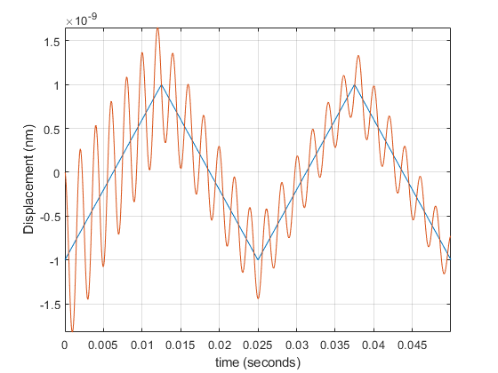
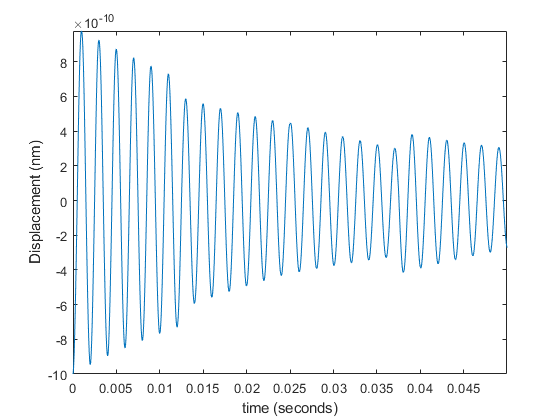
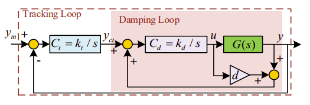
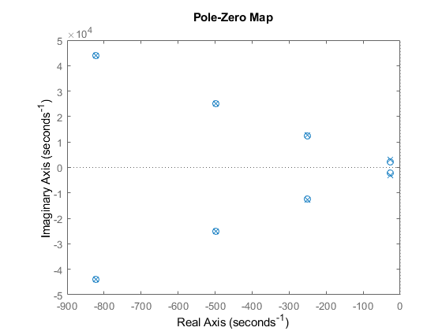
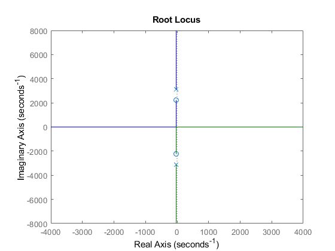
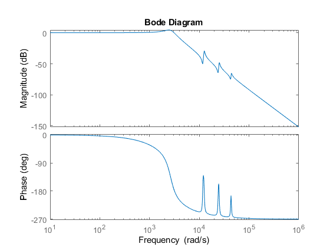
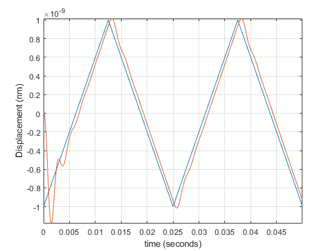
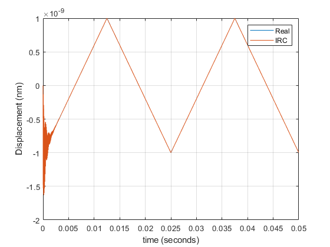

**Controller Design **


```matlab:Code
sysID; 
```


```text:Output
Warning: Ignoring extra legend entries.
```


```text:Output
G =
 
                                                                                                      
       1.342e07 s^6 + 3.938e10 s^5 + 3.42e16 s^4 + 5.328e19 s^3 + 1.854e25 s^2 + 1.088e28 s + 1.928e33
                                                                                                      
  ----------------------------------------------------------------------------------------------------------
                                                                                                            
  s^8 + 3199 s^7 + 2.738e09 s^6 + 4.857e12 s^5 + 1.656e18 s^4 + 1.219e21 s^3 + 2.091e26 s^2 + 2.136e28 s    
                                                                                                            
                                                                                                  + 1.905e33
                                                                                                            
 
Continuous-time identified transfer function.

Parameterization:
   Number of poles: 8   Number of zeros: 6
   Number of free coefficients: 15
   Use "tfdata", "getpvec", "getcov" for parameters and their uncertainties.

Status:                                                
Estimated using TFEST on frequency response data "sys".
Fit to estimation data: 99.9%                          
FPE: 2.326e-06, MSE: 2.323e-06                         
char = '\frac{\frac{3603061052953437\,s^6}{268435456}+\frac{5133228042542267\,s^5}{131072}+34201960011978316\,s^4+53190017306428194816\,s^3+18535717911085316239785984\,s^2+10881908091434080772873519104\,s+1928359649544455558686253089030144}{s^8+\frac{7034612434488761\,s^7}{2199023255552}+\frac{5741166758948537\,s^6}{2097152}+\frac{2486760026298577\,s^5}{512}+1656442354377754880\,s^4+1218871679859894779904\,s^3+209140172229026439596343296\,s^2+21356621499507234816277872640\,s+1904834843397118558787398335987712}'
```








```matlab:Code
[A,B,C,D] = tf2ss(cell2mat(G_comp.Numerator),cell2mat(G_comp.Denominator))
```


```text:Output
A = 8x8    
1.0e+33 *

   -0.0000   -0.0000   -0.0000   -0.0000   -0.0000   -0.0000   -0.0000   -1.9048
    0.0000         0         0         0         0         0         0         0
         0    0.0000         0         0         0         0         0         0
         0         0    0.0000         0         0         0         0         0
         0         0         0    0.0000         0         0         0         0
         0         0         0         0    0.0000         0         0         0
         0         0         0         0         0    0.0000         0         0
         0         0         0         0         0         0    0.0000         0

B = 8x1    
     1
     0
     0
     0
     0
     0
     0
     0

C = 1x8    
1.0e+33 *

         0    0.0000    0.0000    0.0000    0.0000    0.0000    0.0000    1.9284

D = 0
```


```matlab:Code
eigen_values = eig(A)
```


```text:Output
eigen_values = 8x1 complex    
1.0e+04 *

  -0.0822 + 4.3982i
  -0.0822 - 4.3982i
  -0.0498 + 2.5127i
  -0.0498 - 2.5127i
  -0.0251 + 1.2564i
  -0.0251 - 1.2564i
  -0.0028 + 0.3141i
  -0.0028 - 0.3141i

```


```matlab:Code
figure 
pzmap(G_comp)
```


Steps to Designing an Integral Resonant Controller 


   -  Determine the required feed-through term that induces a zero at a frequency lower than the first dominant resonant mode of the system. 
   -  Designing a simple integrator to dampen the first resonant mode and maximize damping ratio  
   -  Designing a tracking controller to minimize the gain to 1  


         


Following on from Lemma 2 [1]


Feedthrough term, d can be selected as : 


```matlab:Code
G4
```


```text:Output
G4 =
 
          9.87e06
  -----------------------
  s^2 + 55.29 s + 9.87e06
 
Continuous-time transfer function.
```


```matlab:Code
d = -2*(9.87e06^2)/(9.87e06^2)
```


```text:Output
d = -2
```


```matlab:Code
G_df = G_comp + d
```


```text:Output
G_df =
 
                                                                                                            
  -2 s^8 - 6398 s^7 - 5.462e09 s^6 - 9.675e12 s^5 - 3.279e18 s^4 - 2.385e21 s^3 - 3.997e26 s^2 - 3.183e28 s 
                                                                                                            
                                                                                                  - 1.881e33
                                                                                                            
  ----------------------------------------------------------------------------------------------------------
                                                                                                            
  s^8 + 3199 s^7 + 2.738e09 s^6 + 4.857e12 s^5 + 1.656e18 s^4 + 1.219e21 s^3 + 2.091e26 s^2 + 2.136e28 s    
                                                                                                            
                                                                                                  + 1.905e33
                                                                                                            
 
Continuous-time transfer function.
```


```matlab:Code
figure 
pzmap(G_comp)
```


```matlab:Code
figure 
pzmap(G_df)
```





```matlab:Code
figure 
rlocus(G4 + d)
```





Damping Controller Design


```matlab:Code
wn = sqrt(9.87e06);
kd = (1/abs(d))*wn*sqrt(wn/sqrt(9.87e06 + (9.87e06/-2)));
C_damp = tf(kd,[1,1])
```


```text:Output
C_damp =
 
  1868
  -----
  s + 1
 
Continuous-time transfer function.
```


Inner  Damping Loop Transfer Function and Simulation


```matlab:Code
%G_damp = feedback(G_df*C_damp,+1)
G_damp = C_damp*G_comp/(1-(C_damp*G_df))
```


```text:Output
G_damp =
 
                                                                                                               
  2.507e10 s^15 + 1.534e14 s^14 + 1.328e20 s^13 + 6.259e23 s^12 + 2.517e29 s^11 + 8.654e32 s^10 + 2.101e38 s^9 
                                                                                                               
          + 4.939e41 s^8 + 8.085e46 s^7 + 1.157e50 s^6 + 1.336e55 s^5 + 9.584e57 s^4 + 8.198e62 s^3            
                                                                                                               
                                                                      + 1.165e65 s^2 + 6.862e69 s + 6.862e69   
                                                                                                               
  -------------------------------------------------------------------------------------------------------------
                                                                                                             
   s^18 + 1.014e04 s^17 + 5.509e09 s^16 + 4.771e13 s^15 + 1.094e19 s^14 + 8.001e22 s^13 + 9.667e27 s^12      
                                                                                                             
           + 5.948e31 s^11 + 3.994e36 s^10 + 2.058e40 s^9 + 7.277e44 s^8 + 3.154e48 s^7 + 5.223e52 s^6       
                                                                                                             
                          + 1.875e56 s^5 + 8.386e59 s^4 + 2.242e63 s^3 + 3.819e66 s^2 + 6.702e69 s + 6.698e69
                                                                                                             
 
Continuous-time transfer function.
```


```matlab:Code
bode(G_damp)
```





```matlab:Code
x = 1e-9*sawtooth(2*pi*40*t,1/2);
x_model = lsim(G_damp,x,t);
figure
plot(t,x,t,x_model)
axis('tight')
grid on
ylabel('Displacement (nm)')
xlabel('time (seconds)')
```





**Tracking Controller **


```matlab:Code
kt = - (9.87e06 + d*9.87e06)/(d^2);
C_track = -tf(kt,[1,1])
```


```text:Output
C_track =
 
  -2.468e06
  ---------
    s + 1
 
Continuous-time transfer function.
```


```matlab:Code
G_damp_irc = C_damp*G_df/(1-C_damp*G_df);
G_close = C_track*G_damp_irc/(1 + C_track*G_damp_irc);
bode(G_close)
```


```matlab:Code
x = 1e-9*sawtooth(2*pi*40*t,1/2);
x_model = lsim(G_close,x,t);
```


```text:Output
Warning: The input signal is undersampled. Use a sampling period smaller than 1.5e-05.
```


```matlab:Code
figure
plot(t,x,t,x_model)
%axis('tight')
grid on
ylabel('Displacement (nm)')
xlabel('time (seconds)')
legend('Real', 'IRC')
```





```matlab:Code
error = x-x_model';
figure 
plot(t,error)
axis('tight')
ylabel('Displacement (nm)')
xlabel('time (seconds)')
```


